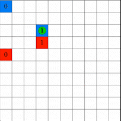
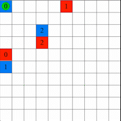
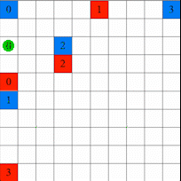

# Welfare and Fairness in Multi-objective Reinforcement Learning
[](https://dl.acm.org/doi/abs/10.5555/3545946.3598870)
 [](https://arxiv.org/abs/2212.01382)

This repository contains our implementation of experiments in the paper "Welfare and Fairness in Multi-objective Reinforcement Learning." Our work was published at The International Conference on Autonomous Agents and Multiagent Systems (AAMAS) in 2023.

## Requirements
To install the necessary packages, run 
```bash
pip install -r requirements.txt
```

## Code Structure
The code has two major parts:
* Simulated enviroments: `Fair_Taxi_MDP_Penalty_V2.py` and `resource_gathering.py`
* Algorithm implementation: `linear_scalarization.py`, `mixture_policy.py`, `nsw_ql.py`, `other_welfare.py`, and `ql.py`

### Experiments
* To reproduce our results for Welfare Q-learning with NSW, mixture policy, and linear scalarization baselines, run those files with same hyper-parameter as reported in the paper, respectively: `nsw_ql.py`, `mixture_policy.py`, `linear_scalarization.py`
* To reproduce our results in the supplementary material for other welfare functions (egalitarian, p-welfare), select the welfare function of your choice in the file, and run `other_welfare.py` with same hyper-parameters.

### See My Agent
I personally find it very satisfying to see the performance of trained agents. Thus, I have provided `evaluate.py` in this repository, which can be used to render the performance of trained agents using PyGame. To use `evaluate.py`, load the trained Q-table saved from training, and pass it into `eval_nsw()` function. An example of the rendering is shown below.

### Visualization Example

Our agent (the moving circle) is a taxi driver who is trying to deliver passengers from multiple different locations (red, blue squares represent destinations and origins, respectively). When the circle turns green, it means there is a passenger currently in taxi, with the number indicating where the passenger originates. When the circle turns orange, it means the taxi is currently empty and is available to pick a new passenger. The goal of the agent is to perform delivery services fairly over the locations, which is defined by maximizing expected *Nash Social Welfare* in this specific case.

  


## Citation
```BibTex
@inproceedings{fan2023welfare,
  title={Welfare and Fairness in Multi-objective Reinforcement Learning},
  author={Fan, Ziming and Peng, Nianli and Tian, Muhang and Fain, Brandon},
  booktitle={Proceedings of the 2023 International Conference on Autonomous Agents and Multiagent Systems},
  pages={1991--1999},
  year={2023}
}
```
